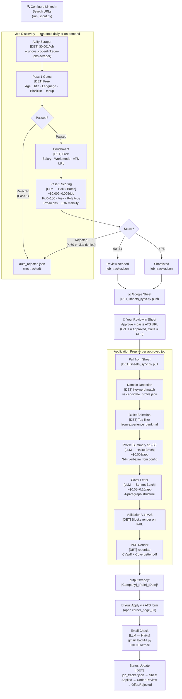

# GUIDE.md — Complete Reference

> **⚠️ IMPORTANT: Read before your first run**
>
> This pipeline was converted from a personal analytics job-search project.
> It has been thoroughly generalised, but you may encounter:
> - Analytics/UK-specific examples in edge cases — replace with your own
> - Integration paths not tested on every configuration
> - Scripts that may need minor fixes for your specific setup
>
> **Recommended first-run sequence:**
> 1. Complete §4 (Setup) and fill all `[YOUR_...]` placeholders
> 2. `python3 scripts/check_workflow.py` ← all checks must pass
> 3. `python3 scripts/run_scout.py --dry-run` ← no API cost
> 4. Manually review your first 5 results before approving anything
>
> **Report bugs:** open a GitHub issue with script name + error message + your `candidate_profile.json` (redact personal data).

---

## Contents

1. [What This Pipeline Does](#1-what-this-pipeline-does)
2. [Pipeline Architecture](#2-pipeline-architecture)
3. [Cost & Infrastructure](#3-cost--infrastructure)
4. [Setup — Step by Step](#4-setup--step-by-step)
5. [First Run Walkthrough](#5-first-run-walkthrough)
6. [Customisation Guide](#6-customisation-guide)

---

## 1. What This Pipeline Does

This is an end-to-end job-search automation system. It discovers jobs on LinkedIn via Apify, scores them against your profile using Claude AI, generates a tailored resume and cover letter PDF per application, tracks email responses, and mirrors everything to a Google Sheet dashboard. It supports any profession and 7 geographic markets (UK, NL, DE, DK, IE, SE, AE). A typical active job seeker spends **$3–10/month** on API and scraping costs. The Claude Code Pro subscription ($20/month) is a separate fixed cost for the interactive orchestration layer.

---

## 2. Pipeline Architecture

### 2a. How It Works



**[DET]** = Deterministic Python — no AI, no API cost, reproducible.
**[LLM]** = Claude API call — inference, batch-mode by default for 50% cost saving.

---

### 2b. Deterministic vs. LLM — Complete Stage Reference

**The majority of the pipeline is deterministic.** Claude is only called for: job scoring (Pass 2), profile summary generation, cover letter drafting, and email classification. Everything else is Python rule-logic with no inference.

| Stage | Script | Mode | What it does |
|-------|--------|------|--------------|
| LinkedIn scraping | `apify_cache.py` | **Deterministic** | URL-based scrape; 24h cache prevents re-billing |
| Pass 1: age gate | `score_jobs.py` | **Deterministic** | Rejects posts older than `MAX_AGE` days |
| Pass 1: title gate | `score_jobs.py` | **Deterministic** | `TITLE_REJECT_CONTAINS` substring match |
| Pass 1: language gate | `score_jobs.py` | **Deterministic** | Phrase + function-word detection (NL/DE/SE/DK) |
| Pass 1: deduplication | `score_jobs.py` | **Deterministic** | `job_id` match + fuzzy company+title match |
| Pass 1: tier gate | `classify_title.py` | **Deterministic** | Rejects below-seniority titles (configurable) |
| Enrichment | `enrich_jobs.py` | **Deterministic** | Salary parse, work_mode, ATS URL extraction |
| **Pass 2: scoring** | `score_jobs.py` | **LLM (Haiku batch)** | Fit score 0–100, visa check, role_focus, pros/cons |
| Domain detection | `auto_prep.py` | **Deterministic** | Keyword match vs `candidate_profile.json → domains` |
| Bullet selection | `auto_prep.py` | **Deterministic** | Tag-based filter from `experience_bank.md` |
| **Profile summary** | `generate_summaries.py` | **LLM (Haiku batch)** | S1–S3 generated; S4+ verbatim from config |
| **Cover letter** | `generate_covers.py` | **LLM (Sonnet batch)** | 4-paragraph cover letter with structured instructions |
| **Email classification** | `gmail_backfill.py` | **LLM (Haiku)** | Intent classification + fuzzy match to tracker |
| Validation (V1–V23) | `validate_prep.py` | **Deterministic** | Rule checks; FAIL blocks PDF rendering |
| PDF rendering | `pdf_renderer.py` | **Deterministic** | reportlab A4 layout — no inference |
| Sheet sync | `sheets_sync.py` | **Deterministic** | JSON ↔ Google Sheets bidirectional |
| Referral tracking | `referral_tracker.py` | **Deterministic** | Day-based status advancement (day 4 → Followup, day 8 → Stale) |

---

### 2c. Anti-Hallucination Design

The pipeline uses three layers to prevent fabricated content in your resume and cover letter.

#### Layer 1 — Source Constraint

Resume bullets are selected from `data/content/experience_bank.md` — a file you write yourself. The LLM ranks and arranges bullets; it **never generates new achievements**. Only text you wrote can appear in the final PDF.

#### Layer 2 — Validation Gate (V1–V23)

`validate_prep.py` runs automatically before every PDF render. A `FAIL` result blocks rendering entirely — you see the error and fix it, rather than receiving a silently wrong document.

Key validation checks:

| Check | What it validates | Configurable? |
|-------|-------------------|---------------|
| V1 | Required portfolio tools are present in Skills section | Yes — `candidate_profile.json → required_portfolio_tools` |
| V2 | Excluded tools are absent from Skills and Summary | Yes — `candidate_profile.json → excluded_tools` |
| V7 | Canonical metric strings appear unchanged | Yes — `candidate_profile.json → canonical_metrics` |
| V13 | British English spelling enforced | Yes — disable for US/AU targeting (see note below) |
| V17 | Industry whitelist is honoured | Yes — `candidate_profile.json → industry_whitelist` |
| V18 | No third-person pronouns ("his", "her", "their") | No — always active; catches LLM drift |
| V23 | Cover letter word count within 350–450 words | No — always active |

**Note on V13 (British English):** If you are targeting US or Australian markets, open `scripts/validate_prep.py`, find the `_check_v13` function, and comment it out. American spellings ("optimize", "behavior", "analyze") will no longer trigger a FAIL.

#### Layer 3 — Metric Preservation

Exact metric strings (e.g. `"improved conversion by 18%"`) must appear verbatim in the output. V7 checks this by comparing against `canonical_metrics` in your config. If a metric is paraphrased or rounded, the render is blocked.

#### Adding Your Own Checks (V24+)

```python
# In scripts/validate_prep.py — add below the last _check_vN function:
def _check_v24(resume_data: dict, cover_data: dict, meta: dict) -> list[str]:
    """V24: Describe what this check validates."""
    issues = []
    # Your logic here — return a non-empty list if the check fails
    if some_condition_fails:
        issues.append("V24 FAIL: description of the problem")
    return issues

# Then register it in the ALL_CHECKS list at the bottom of the file:
ALL_CHECKS = [...existing_checks..., _check_v24]
```

---

## 3. Cost & Infrastructure

### 3a. Fixed Monthly Costs

| Service | Plan | Cost | Notes |
|---------|------|------|-------|
| Claude Code | Pro | $20/month | Interactive orchestration sessions. Includes Sonnet for conversations. |
| Claude API | Pay-as-you-go | See §3b | Separate billing. Scripts use `ANTHROPIC_API_KEY` directly. |
| Apify | Free tier | $0/month | $5 free credit/month — enough for ~5–6 full multi-market scout runs. |
| Google Sheets API | Free | $0/month | Service account. No billing for normal usage volumes. |
| Email (IMAP) | Free | $0/month | Yahoo, Gmail, or any standard IMAP provider. |

**Important distinction:** Claude Code Pro ($20/month) covers your interactive sessions — the conversations where you review results, approve jobs, and run commands. It does **not** cover the Claude API calls made by the scripts. Those are billed separately to your API account via `ANTHROPIC_API_KEY`.

### 3b. Variable Costs Per Run

**Job Scout (per run, ~50 jobs scored after Pass 1 filtering):**

| Stage | Model | Pricing mode | Estimated cost |
|-------|-------|-------------|----------------|
| Pass 1 | Python rules | Free | $0.00 |
| Apify scrape | — | $0.001/job raw | ~$0.05–0.20 (varies by search size) |
| Pass 2 scoring | Haiku 4.5 | Batch (50% off) + prompt caching (~90% token saving) | ~$0.05–0.15 total |

**Application Prep (per approved job):**

| Stage | Model | Pricing mode | Estimated cost |
|-------|-------|-------------|----------------|
| Profile summary | Haiku 4.5 | Batch (50% off) | ~$0.002 |
| Cover letter | Sonnet 4.6 | Batch (50% off) | ~$0.05–0.10 |
| **Per application total** | | | **~$0.05–0.12** |

### 3c. Practical Monthly Estimates

| Usage level | Scout runs | Applications/month | Apify | Claude API | **Total** |
|-------------|-----------|-------------------|-------|-----------|-----------|
| Light (1×/week, 3 apps/week) | 4 | 12 | $0* | ~$0.80 | **~$0.80/mo** |
| Active (2×/week, 5 apps/week) | 8 | 20 | ~$1.40 | ~$2.00 | **~$3.40/mo** |
| Heavy (daily, 10 apps/week) | 20 | 40 | ~$6.00 | ~$4.50 | **~$10.50/mo** |

\*Light usage stays within Apify's $5/month free credit.

### 3d. Built-In Cost Optimisations (Never Disable)

- **Apify 24h cache** — same-day re-runs cost $0 (results are cached)
- **Batch API** — 50% off real-time pricing; automatic in `score_jobs.py` and `generate_covers.py`
- **Prompt caching** — ~90% input token savings when scoring the same market in one session
- **Pass 1 gates** — filters 30–60% of jobs before any API call; completely free

### 3e. Reducing Costs Further

- Switch `generate_summaries.py` from Haiku to a smaller/cheaper model if quality is sufficient
- Increase `STALE_AGE_DAYS` in `score_jobs.py` to scout less frequently
- Reduce `max_jobs` per URL in `SEARCHES_APIFY` (third tuple element)
- Use `--market uk` instead of `--market intl` to limit to one market per run

---

## 4. Setup — Step by Step

Minimum time: **~30 minutes** for a basic working configuration.

**Quickest path:** run the interactive setup wizard, which handles Steps 1–6:
```bash
python3 scripts/setup_wizard.py
```
The wizard covers: `.env` setup, candidate profile, experience structure, market/salary selection,
LinkedIn search URL builder, and scoring rubric generation. Complete Steps 7–11 manually afterwards.

---

### Prerequisites

| Requirement | Why needed | How to get |
|-------------|-----------|-----------|
| Python 3.10+ | Scripts use modern type syntax | [python.org](https://python.org) or `pyenv` |
| Node.js 16+ | MCP server runs via `npx` | [nodejs.org](https://nodejs.org) |
| Claude Code Pro | Interactive orchestration | [claude.ai/code](https://claude.ai/code) → Subscribe |
| Anthropic API key | LLM scoring + cover letter generation | [console.anthropic.com](https://console.anthropic.com) |
| Apify account + token | LinkedIn job scraping | [apify.com](https://apify.com) — free tier |
| Google account | Sheets sync (optional but recommended) | [accounts.google.com](https://accounts.google.com) |
| IMAP email address | Tracking application response emails | Yahoo / Gmail / any IMAP provider |

---

### Step 1: Clone and Install

```bash
git clone https://github.com/YOUR_USERNAME/Claude-Workflow-Automation-public.git
cd Claude-Workflow-Automation-public
python3 -m venv .venv
source .venv/bin/activate      # Windows: .venv\Scripts\activate
pip install -r requirements.txt
```

---

### Step 2: Create .env

```bash
cp .env.example .env
nano .env    # or open in any editor
```

**Required variables:**

| Variable | Where to get it |
|----------|----------------|
| `ANTHROPIC_API_KEY` | [console.anthropic.com](https://console.anthropic.com) → API Keys |
| `APIFY_TOKEN` | console.apify.com → Settings → Integrations → API token |
| `IMAP_EMAIL` | Your email address used for job application tracking |
| `IMAP_APP_PASSWORD` | security.yahoo.com → App passwords (or equivalent for Gmail) |
| `GOOGLE_SHEET_ID` | From Sheet URL: `docs.google.com/spreadsheets/d/[THIS_PART]/edit` |

**Optional variables:**

| Variable | Purpose |
|----------|---------|
| `GITHUB_TOKEN` | Enables `git_sync.py` — auto push tracker data to GitHub |
| `GITHUB_REPO` | `username/repo-name` — used by `monitor_scout.py` for CI monitoring |

---

### Step 3: Fill candidate_profile.json

This is the **single config file** for all your personal details. Open:
```
data/content/candidate_profile.json
```

**Minimum required fields for a first run:**

```json
{
  "contact": {
    "name": "Your Full Name",
    "email": "you@example.com",
    "phone": "+1 234 567 8900",
    "linkedin": "linkedin.com/in/your-name",
    "address": "Your City, Country"
  },
  "profile": {
    "years_of_experience": 8,
    "target_roles": ["Your Target Role 1", "Your Target Role 2"]
  },
  "core_skills": {
    "skills": ["Python", "SQL", "Your Tool 3"]
  },
  "experience": [
    {
      "company": "Most Recent Company",
      "role": "Your Job Title",
      "dates": "2022-06–present",
      "bank_key": "Most Recent Company",
      "max_bullets": 5
    }
  ],
  "has_right_to_work": {
    "markets": []
  }
}
```

`has_right_to_work.markets` — list market codes where you already have the right to work (e.g. `["uk"]`). For those markets, visa sponsorship checks are skipped. Leave empty if you need sponsorship everywhere.

See `CONFIGURATION.md` for all available fields and their effects on scoring, PDF layout, and validation.

---

### Step 4: Write experience_bank.md

`data/content/experience_bank.md` is where **all resume bullets come from**. The pipeline selects from this file — it never generates new content.

**Option A — AI bootstrap from your existing CV (recommended):**
setup_wizard.py Step 3 now offers to parse your existing CV. When prompted:
1. Provide a file path to your PDF or .txt CV, or paste the text directly
2. Claude Haiku parses it into the correct experience_bank.md format with domain tags
3. Review the output — verify metrics, adjust tags, remove any parsing errors

**Option B — Write manually:**

```markdown
## Company Name    ← must match bank_key in candidate_profile.json

Your Job Title | 2022-06–present

• [tag] Action verb + context + specific, verifiable metric
• [tag] Another achievement with a measurable outcome
• [tag] Leadership, mentoring, or strategic contribution
```

**Rules (apply to both options):**
- Only include achievements you can defend in an interview
- Tags must match keywords in your `candidate_profile.json → domains` section
- Aim for 6–10 bullets per role — the pipeline selects the most relevant ones per job
- Metric strings must be exact (e.g. `"improved conversion by 18%"`) — V7 validation checks these

---

### Step 5: Configure LinkedIn Search URLs

**Handled by setup_wizard.py Step 5 (recommended)**

The wizard builds search URLs interactively — you choose keywords, market, date window (Past 24 hours / Past week / Past month), and contract inclusion. It saves entries to `data/content/search_config.json`, which `run_scout.py` reads automatically.

**LinkedIn date filter note:** LinkedIn only supports three date windows — Past 24 hours, Past week, and Past month. Custom date ranges are not available via the API.

**To add searches after setup:** edit `data/content/search_config.json` directly:

```json
{
  "searches": [
    {
      "label": "Head of Analytics — UK",
      "market": "uk",
      "keywords": "Head of Analytics",
      "time_window": "r86400",
      "include_contract": false,
      "max_jobs": 100
    }
  ]
}
```

**Market geoIds (for reference — wizard fills these automatically):**

| Market | geoId |
|--------|-------|
| United Kingdom | `101165590` |
| Netherlands | `102890719` |
| Germany | `101282230` |
| Denmark | `104514075` |
| Ireland | `104738515` |
| Sweden | `105117694` |
| UAE | `104305776` |

See `CONFIGURATION.md §5` for advanced URL parameters and filter reliability notes.

---

### Step 6: Set Salary Thresholds

**Handled by setup_wizard.py Step 4 (recommended)**

The wizard prompts for a minimum annual salary per market and writes to `candidate_profile.json → salary_thresholds`. No Python editing required.

**To edit directly** after setup:
```json
{
  "salary_thresholds": {
    "uk": 80000,
    "nl": 90000,
    "de": 90000,
    "dk": 700000,
    "ie": 90000,
    "se": 800000,
    "ae": 360000
  }
}
```

Jobs with a stated salary below your threshold are auto-rejected by Pass 1. Jobs with no stated salary are flagged as `salary_gate = "tbc"` and passed through for human review. Remote/contract roles are screened at 80% of the threshold automatically.

---

### Step 7: Configure score_jobs.py Filters

Open `scripts/score_jobs.py` and locate the `# ── USER CONFIG ──` block near the top of the file.

Key settings for your first run:

| Variable | Default | What it does |
|----------|---------|--------------|
| `TARGET_TITLE_KEYWORDS` | `set()` | Keywords present in your target job titles — used for stale-post classification |
| `TITLE_REJECT_CONTAINS` | `[]` | Substrings that auto-reject a job title (e.g. `["intern", "junior"]`) |
| `_MARKET_BRAND_ALLOWLIST` | `{}` | If set, only jobs from listed companies pass in that market |
| `_CONSULTING_BLOCKLIST_SUBSTRINGS` | `set()` | Company name substrings to block (e.g. consulting firms you don't want) |

**For your first run:** leave `TITLE_REJECT_CONTAINS` as `[]` and `_MARKET_BRAND_ALLOWLIST` as `{}`. Add patterns after reviewing your first results.

See `CONFIGURATION.md §6` for all USER CONFIG options and their interactions.

---

### Step 8: Configure docs/fit-scoring-rubric.md

**Handled by setup_wizard.py Step 6 (recommended)**

The wizard's scoring rubric builder asks structured questions and generates the file:
- Tier 1–4 job title targets (highest-priority → borderline)
- Preferred industries and company types
- Core skills to match against
- Target UK cities with location scores (other markets are pre-configured)

**To edit after wizard generation:** open `docs/fit-scoring-rubric.md` directly — it's a plain text file. Claude reads it at every session start via `CLAUDE.md @docs/fit-scoring-rubric.md`.

**This file directly controls which jobs get shortlisted vs. rejected.** An unedited or misconfigured rubric produces poor scoring results — review it after the first scout run.

---

### Step 9: Set Up Google Sheets (Recommended)

Google Sheets acts as a human-readable dashboard where you review shortlisted jobs, approve applications, and paste ATS URLs.

1. Create a new Google Sheet at [sheets.google.com](https://sheets.google.com)
2. Create a GCP service account: console.cloud.google.com → IAM → Service Accounts → Create
3. Download the JSON key → rename to `data/google_service_account.json`
4. Share the Sheet with the service account email (Editor access)
5. Copy the Sheet ID from the URL into your `.env` as `GOOGLE_SHEET_ID`

See `templates/google_sheets_setup.md` for a detailed step-by-step guide.

**Without Google Sheets:** the pipeline still works. All state is in `data/job_tracker.json`. You review and approve jobs by editing that file directly, then running `python3 scripts/sheets_sync.py pull` to apply changes.

---

### Step 10: Open in Claude Code

```bash
cd Claude-Workflow-Automation-public
claude
```

Claude Code reads `CLAUDE.md` automatically on startup — the full pipeline context is loaded into every session.

Verify MCP is working: type `/mcp` in the Claude Code prompt. You should see the Apify MCP server listed.

---

### Step 11: Run the Integrity Check

```bash
python3 scripts/check_workflow.py
```

All checks must pass. Common failures and fixes:

| Check | Failure message | Fix |
|-------|----------------|-----|
| C1: .env | `.env file missing or empty` | Run `cp .env.example .env` and fill in variables |
| C1: required files | `Missing: data/content/candidate_profile.json` | Run `python3 scripts/setup_wizard.py` to create it |
| C3: tracker | `_meta key missing` | Already seeded in the repo — means file was replaced |
| C5: snapshot | `last_push_snapshot missing` | Fresh install; run `sheets_sync.py push` once |

---

### Step 12: First Dry Run

```bash
python3 scripts/run_scout.py --dry-run
```

No API calls. Prints your configured searches, estimated job counts, and estimated cost. Verify the URLs and market codes look correct before spending any credit.

---

### Step 13: First Live Scout

```bash
python3 scripts/run_scout.py --market uk --yes
python3 scripts/write_tracker.py
python3 scripts/sheets_sync.py push --tabs apps,archive   # if using Sheets
python3 scripts/scout_analysis.py
```

**Manually review your first 5 shortlisted results** before approving any application. Verify the scoring rubric is producing sensible results for your profession and target roles.

---

## 5. First Run Walkthrough

After your first scout completes:

### Review Shortlisted Jobs

**Via Google Sheet:**
- Open your Sheet → Applications tab
- Filter Col H (status) for "Shortlisted" and "Review Needed"
- Read each row: company, role, fit score, pros/cons, visa status

**Via JSON (no Sheet):**
```bash
python3 -c "
import json
data = json.load(open('data/job_tracker.json'))
for job in data['applications']:
    if job['status'] in ('Shortlisted', 'Review Needed'):
        print(job['status'], job['company'], job['role_title'], job.get('fit_score'))
"
```

### Approve a Job

For each job you want to apply to:
1. Find the company's careers page or ATS application form
2. Paste the ATS URL into Col K (`career_page_url`) in the Sheet
3. Change Col H (`status`) to `Approved`

**Edit order matters:** paste the URL first, then set status to Approved. Application prep requires the URL to be present before it runs.

### Pull Changes

```bash
python3 scripts/sheets_sync.py pull --tabs apps,archive
```

### Run Application Prep

Prep runs automatically via the `on_job_approved` hook if you have hooks configured. Or run manually:

```bash
python3 scripts/application_prep.py
```

This generates the tailored resume and cover letter PDFs for all Approved jobs that haven't been prepped yet.

### Review Generated Documents

Open `outputs/applications/ready/[Company]_[Role]_[Date]/`:
```
[YourName]_CV.pdf            ← tailored resume (named from candidate_profile.json → contact.name)
[YourName]_CoverLetter.pdf   ← targeted cover letter
meta.json                    ← ATS URL, job_id, tracking notes
```

Read both PDFs before submitting. Check that:
- Your name and contact details are correct
- The bullet points are appropriate for this role
- The cover letter names the correct company and role
- No metric strings have been paraphrased

### Apply

Open `career_page_url` from `meta.json` and upload the PDFs via the ATS form.

### Track Response Emails

```bash
python3 scripts/gmail_backfill.py --days 2
python3 scripts/sheets_sync.py push --tabs apps,archive
```

The email tracker reads your inbox, classifies emails (Applied / Rejected / Interview Scheduled / etc.), matches them to tracker entries, and updates statuses.

---

## 6. Customisation Guide

After your first successful scout, tune the pipeline for better results. These are the most impactful levers.

### 6a. Scoring Thresholds

In `scripts/score_jobs.py`, find `SHORTLIST_THRESHOLD` and `REVIEW_THRESHOLD`:

```python
SHORTLIST_THRESHOLD = 75   # ≥ 75 → Shortlisted
REVIEW_THRESHOLD = 60      # 60–74 → Review Needed; < 60 → Auto-Rejected
```

- **Too many results?** Raise `SHORTLIST_THRESHOLD` to 80 or 85
- **Too few results?** Lower `REVIEW_THRESHOLD` to 55, or check your rubric for over-restrictive criteria
- **Wrong jobs shortlisted?** The issue is usually in `docs/fit-scoring-rubric.md` — tighten your title and domain descriptions

### 6b. Title Filters

Add patterns to `TITLE_REJECT_CONTAINS` after reviewing your first results:

```python
TITLE_REJECT_CONTAINS = [
    "junior",          # too junior
    "intern",          # internships
    "graduate",        # entry-level
    "your_pattern",    # anything noisy you're seeing
]
```

Add target title keywords for stale-post classification:

```python
TARGET_TITLE_KEYWORDS = {
    "analytics",
    "your_keyword",
}
```

### 6c. Salary Thresholds

Update `SALARY_THRESHOLDS` in `scripts/common.py`. Remote and contract roles use 80% of the market threshold (configurable via `SALARY_THRESHOLDS_REMOTE`):

```python
SALARY_THRESHOLDS_REMOTE = {k: int(v * 0.8) for k, v in SALARY_THRESHOLDS.items()}
# Override individually if needed:
SALARY_THRESHOLDS_REMOTE["uk"] = 70000
```

### 6d. Company Filters

Block entire company types by substring:

```python
_CONSULTING_BLOCKLIST_SUBSTRINGS = {
    "staffing",
    "recruitment",
    "consulting",   # add patterns relevant to your profession
}
```

Restrict a market to specific companies only (e.g. Sweden brand whitelist pattern):

```python
_MARKET_BRAND_ALLOWLIST = {
    "se": {"company_a", "company_b"},  # only these pass in SE
}
```

### 6e. Fit Scoring Rubric

`docs/fit-scoring-rubric.md` is injected into every Pass 2 scoring prompt. It defines:
- Which role titles score 20 / 15 / 10 / 5 / 0 points (title match)
- Which industries score 25 / 15 / 5 / 0 points (domain match)
- Which skills are relevant to your profile (skills match)
- Location scoring tiers per market

Edit this file whenever your target role or market changes. Changes take effect immediately on the next scout run — no code changes needed.

### 6f. Adding Validation Checks (V24+)

```python
# In scripts/validate_prep.py:

def _check_v24(resume_data: dict, cover_data: dict, meta: dict) -> list[str]:
    """V24: Your custom validation — describe what it checks."""
    issues = []
    # Example: ensure a specific section is present
    if "YOUR_CONDITION" not in str(resume_data):
        issues.append("V24 FAIL: YOUR_CONDITION not found in resume")
    return issues  # empty list = pass

# Register at bottom of file in ALL_CHECKS:
ALL_CHECKS = [
    _check_v1, _check_v2, ..., _check_v23,
    _check_v24,   # add here
]
```

### 6g. Swapping Claude Models

| Use case | Default model | Where to change | Cost tradeoff |
|----------|--------------|-----------------|---------------|
| Job scoring (Pass 2) | Haiku 4.5 | `score_jobs.py` `MODEL` constant | Upgrade to Sonnet: ~10× cost, higher nuance |
| Profile summaries | Haiku 4.5 | `generate_summaries.py` `MODEL` constant | Downgrade saves ~$0 (already cheap) |
| Cover letters | Sonnet 4.6 | `generate_covers.py` `MODEL` constant | Downgrade to Haiku: ~50% saving, ~30% quality drop |
| Email classification | Haiku 4.5 | `gmail_backfill.py` `MODEL` constant | Already minimal cost |

Current model IDs: `claude-haiku-4-5-20251001`, `claude-sonnet-4-6`.

### 6h. Adding Markets

To add a new geographic market:

1. **`scripts/score_jobs.py`** — add to `_STALE_DAYS_BY_MARKET`, `_location_score()`, and any language gates
2. **`scripts/run_scout.py`** — add geoId + Apify URL to `SEARCHES_APIFY`
3. **`scripts/common.py`** — add salary threshold to `SALARY_THRESHOLDS`
4. **`candidate_profile.json`** — add visa address under `visa_addresses`
5. **`docs/fit-scoring-rubric.md`** — add city tiers for the new market
6. **`scripts/check_workflow.py`** — verify new market is recognised in market validation

Test with `--market YOUR_CODE --dry-run` before a live run.

### 6i. Referral Outreach Workflow

After application prep generates documents, you can reach out to contacts before applying directly:

**In Claude Code, type:**
```
draft referral message for app_001 — contact: [Name], [LinkedIn URL], they work at [Company] as [Role], we [relationship context]
```

The skill reads `skills/draft_referral_message.md` and drafts a LinkedIn connection note + follow-up message. The workflow then advances the job status through: `Referral-Planned → Connection-Requested → Reached-Out → Followup → Referred`.

Run `python3 scripts/referral_tracker.py` daily to auto-advance statuses based on elapsed time.

Full workflow documentation: `agents/CLAUDE.md §Referral Workflow`.

---

*For daily commands and script usage, see* **TOOL_COMMANDS.md**

*For full parameter reference and field descriptions, see* **CONFIGURATION.md**
