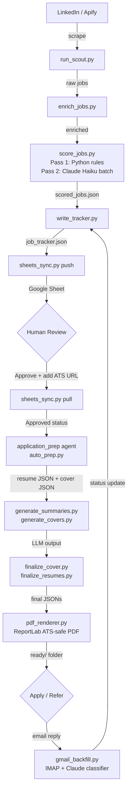

# Claude Workflow Automation — AI-Powered Job Search Pipeline

> **CONVERSION NOTICE:** This library was converted from a personal analytics job search pipeline
> into a general-purpose tool. All personal data has been removed. You may occasionally find
> analytics-specific references — update them to match your profession.
> Before going live: complete CONFIGURE_CHECKLIST.md, run `check_workflow.py`, and do a dry run.

A production-grade, fully autonomous job search pipeline built on Claude Code, Apify, and
the Anthropic API. Originally built as a personal tool, open-sourced for any job seeker in
any profession.

## What it does

- Scrapes LinkedIn jobs daily via Apify across 7 markets (UK, NL, DE, DK, IE, SE, UAE)
- Scores every job in two passes: Python rules (free) then Claude Haiku batch API
- Generates tailored resumes and cover letters as ATS-safe PDFs
- Tracks application status automatically from email replies
- Syncs everything to Google Sheets as a human-readable dashboard
- Manages referral outreach: drafts LinkedIn messages and tracks contact responses

## Architecture



## Quick Start

```bash
# 1. Clone and install
git clone https://github.com/YOUR_USERNAME/Claude-Workflow-Automation-public.git
cd Claude-Workflow-Automation-public
python3 -m venv .venv && source .venv/bin/activate
pip install -r requirements.txt

# 2. Configure
cp .env.example .env          # fill in your API keys
# Fill data/content/candidate_profile.json (see CONFIGURE_CHECKLIST.md)
# Write data/content/experience_bank.md (your resume bullet content)

# 3. Integrity check
python3 scripts/check_workflow.py

# 4. Dry run (no API calls made)
python3 scripts/run_scout.py --dry-run

# 5. First scout run
python3 scripts/run_scout.py --market uk --yes
python3 scripts/write_tracker.py
python3 scripts/sheets_sync.py push --tabs apps,archive

# 6. Review jobs in Google Sheet, approve + add ATS URL, then pull
python3 scripts/sheets_sync.py pull --tabs apps,archive
# In Claude Code: "run application prep"
```

## Documentation

| File | Purpose |
|------|---------|
| CONFIGURE_CHECKLIST.md | Master setup checklist — start here |
| SETUP.md | Prerequisites and step-by-step setup guide |
| CLAUDE_PROJECT_SETUP.md | Claude Code install, MCP config, hooks wiring |
| TOOL_COMMANDS.md | All daily-use commands for every pipeline stage |
| COST_GUIDE.md | Subscription and API cost breakdown with estimates |
| CONFIGURATION.md | Full parameter reference for every config file |
| ANTI_HALLUCINATION.md | Experience bank philosophy and validation checks |
| templates/google_sheets_setup.md | Google Sheets service account setup |

## Cost Summary

| Component | Cost |
|-----------|------|
| Claude Code Pro | $20/month (required subscription) |
| Apify | $0/month (includes $5 free credit — covers ~6 full international runs/month) |
| Claude API | ~$0.10–$0.25 per scout run, ~$0.05–$0.12 per application prep |
| Google Sheets API | Free |
| IMAP email tracking | Free (Yahoo / Gmail / Outlook) |

See COST_GUIDE.md for a full breakdown and practical monthly estimates at different usage levels.

## Supported Markets

UK · Netherlands · Germany · Denmark · Ireland · Sweden · UAE

Each market has its own LinkedIn search configuration, city tier scoring, salary threshold,
and visa framing in generated cover letters. See CONFIGURATION.md for market setup instructions.

## Design Principles

- **No hallucination**: resumes draw only from experience_bank.md — nothing is invented
- **Batch API by default**: 50% cost reduction vs real-time; prompt caching for ~90% input token savings
- **Config-driven**: every personal and profession-specific value lives in candidate_profile.json
- **Validation layer**: 20+ pre-render checks block incorrect content before it reaches any PDF
- **Apify 24h cache**: prevents re-spending on same-day re-runs

## What you need to configure

1. Fill `.env` with your API keys (see .env.example for instructions per variable)
2. Fill `data/content/candidate_profile.json` with your personal and professional details
3. Write `data/content/experience_bank.md` with your work history and bullet points
4. Add your LinkedIn search URLs to `scripts/run_scout.py` (SEARCHES_APIFY block)
5. Set your target roles, salary threshold, and location tiers in `CLAUDE.md §3`
6. Set your scoring rubric in `docs/fit-scoring-rubric.md`

Full step-by-step instructions: CONFIGURE_CHECKLIST.md

## Prerequisites

- Python 3.10+
- Node.js 16+ (required for Claude Code MCP servers)
- Claude Code Pro subscription ($20/month) — claude.ai/code
- Apify account — apify.com (free tier, $5/month credit included)
- Google Cloud account for Sheets API service account (free tier sufficient)
- Yahoo Mail, Gmail, or Outlook account for IMAP email tracking (free)

## License

MIT License. See LICENSE file.
