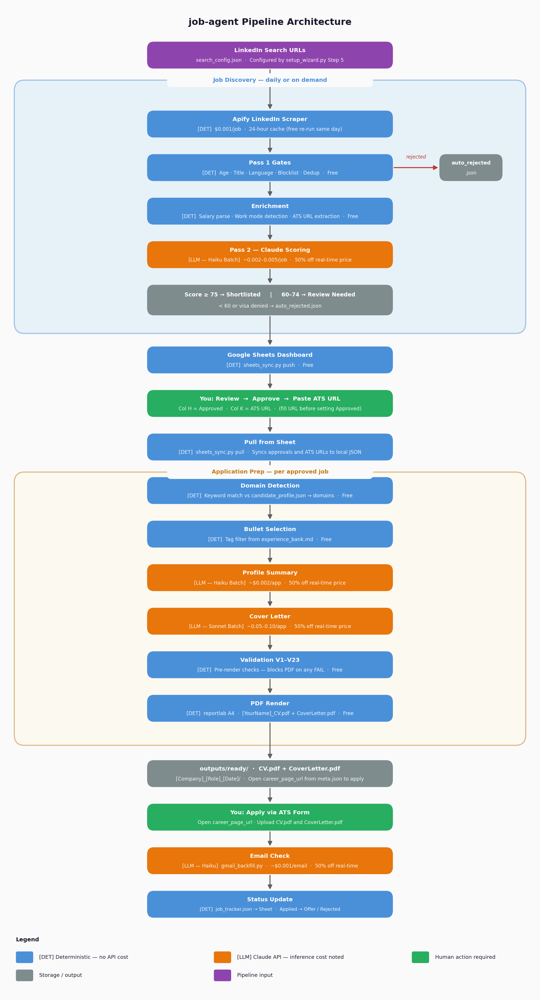
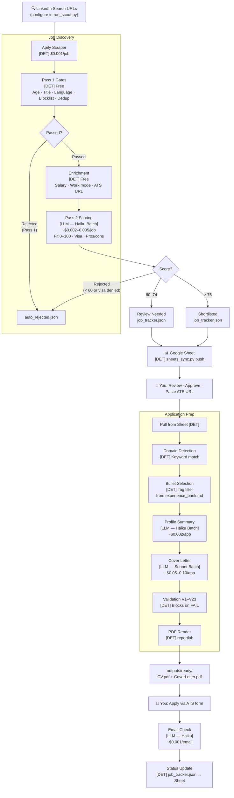

# Claude Workflow Automation — AI-Powered Job Search Pipeline

> **⚠️ IMPORTANT: Read GUIDE.md before your first run.**
> This pipeline was converted from a personal analytics job-search project.
> It has been thoroughly generalised, but you may encounter analytics/UK-specific
> examples in edge cases. Complete GUIDE.md §4 (Setup), run `check_workflow.py`,
> then do a `--dry-run` before spending any API credit.

A production-grade, fully autonomous job search pipeline built on Claude Code, Apify, and
the Anthropic API. Originally built as a personal tool, open-sourced for any job seeker in
any profession.

> **License**: Personal use only — commercial use, SaaS deployment, and sublicensing are
> prohibited. See [License](#license) below.

## What it does

- Scrapes LinkedIn jobs daily via Apify across 7 markets (UK, NL, DE, DK, IE, SE, UAE)
- Scores every job in two passes: Python rules (free) then Claude Haiku batch API (~$0.05–0.15/run)
- Generates tailored resumes and cover letters as ATS-safe PDFs (~$0.05–0.12/application)
- Tracks application status automatically from email replies
- Syncs everything to Google Sheets as a human-readable dashboard
- Manages referral outreach: drafts LinkedIn messages and tracks contact responses

## Everything Is Customisable

Every behaviour in the pipeline can be changed through conversation — no file editing, no code changes:

- **New markets**: *"add France as a new market — salary threshold €80,000, Tier 1 cities Paris and Lyon"* — Claude handles all config automatically.
- **Scoring behaviour**: *"adjust the shortlist threshold to 80"*, *"add a rule that rejects roles without SQL"*, *"score fintech companies 25 points"*
- **Validation rules**: *"add a validation check that blocks any cover letter that doesn't mention experimentation"*
- **Title blocklists and salary thresholds**: *"add 'intern' and 'junior' to my title blocklist"*, *"update my UK salary threshold to £85,000"*
- **Automation hooks**: *"disable the auto-prep hook"*, *"change when referral follow-ups are triggered"*
- **Pipeline behaviour**: *"use Sonnet for cover letters instead of Haiku"*, *"change how I want remote roles framed in cover letters"*

Claude reads your full setup at session start — preferences, rubric, market config, candidate profile — so every request is context-aware. You describe what you want; Claude makes the change.

## Architecture

**[DET]** = Deterministic Python — free, reproducible. **[LLM]** = Claude API — inference cost noted.



<details>
<summary>Text diagram (Mermaid)</summary>



</details>

## Quick Start

```bash
# 1. Clone and install
git clone https://github.com/YOUR_USERNAME/job-agent.git
cd job-agent
python3 -m venv .venv && source .venv/bin/activate
pip install -r requirements.txt

# 2. Run setup wizard (handles Steps 1–6 interactively)
python3 scripts/setup_wizard.py
# Then complete Steps 7–11 in GUIDE.md §4

# 3. Integrity check (all checks must pass before first run)
python3 scripts/check_workflow.py

# 4. Dry run — no API calls, shows search config + cost estimate
python3 scripts/run_scout.py --dry-run

# 5. First live scout
python3 scripts/run_scout.py --market uk --yes
python3 scripts/write_tracker.py
python3 scripts/scout_analysis.py
python3 scripts/sheets_sync.py push --tabs apps,archive

# 6. Review in Sheet → approve + paste ATS URL → pull → prep
python3 scripts/sheets_sync.py pull --tabs apps,archive
# In Claude Code: "run application prep"
```

Full setup guide: **GUIDE.md §4** (30 min minimum). For daily commands: **TOOL_COMMANDS.md**.

## Documentation

| File | Purpose |
|------|---------|
| **GUIDE.md** | Complete reference: architecture, costs, setup, first run, customisation |
| **TOOL_COMMANDS.md** | All daily-use commands for every pipeline stage |
| **CONFIGURATION.md** | Full parameter reference for every config file |
| `templates/google_sheets_setup.md` | Google Sheets service account setup guide |

## Cost Summary

| Component | Cost |
|-----------|------|
| Claude Code Pro | $20/month (required — covers interactive sessions, not API calls) |
| Apify | $0/month (includes $5 free credit — covers ~6 full international runs/month) |
| Claude API | ~$0.05–$0.15 per scout run · ~$0.05–$0.12 per application prep |
| Google Sheets API | Free |
| IMAP email tracking | Free (Yahoo / Gmail / Outlook) |

Full cost breakdown with monthly estimates at different usage levels: **GUIDE.md §3**.

## Supported Markets

7 markets pre-configured out of the box — **and you can add any market in minutes:**

| Market | Visa type |
|--------|-----------|
| UK | Skilled Worker Visa |
| Netherlands | Kennismigrant |
| Germany | EU Blue Card |
| Denmark | Pay Limit Scheme |
| Ireland | Critical Skills Employment Permit |
| Sweden | Arbetstillstånd |
| UAE | Employment Visa |

**Adding a new market**: say *"add [country] as a new market — salary threshold [X], Tier 1 cities [list]"* in Claude Code. Claude handles all config automatically. See GUIDE.md §6g for details.

## Extend and Customise via Claude Interactions

Once set up, you can extend the pipeline through natural language in your Claude Code session — no
script editing required for most customisations:

| What you want | Say in Claude Code |
|---------------|-------------------|
| Add a new target market | "add [country] as a new market with salary threshold [X]" |
| Score a specific job | "score this job: [paste JD]" |
| Draft a cover letter | "draft cover letter for app_001" |
| Add a validation rule | "add a validation check that blocks [condition]" |
| Draft a referral message | "draft referral message for app_001 — contact: [name], [LinkedIn], [relationship]" |
| Analyse scout results | "run scout analysis and show me the keyword overlap" |
| Tune scoring thresholds | "adjust shortlist threshold to 80 and explain the tradeoff" |

Claude reads `CLAUDE.md` at session start, which loads your full pipeline context — preferences,
rubric, market config, and candidate profile — so every interaction is aware of your setup.

## Design Principles

- **No hallucination**: resumes draw only from experience_bank.md — nothing is invented
- **Batch API by default**: 50% cost reduction vs real-time; prompt caching for ~90% input token savings
- **Config-driven**: every personal and profession-specific value lives in candidate_profile.json
- **Validation layer**: 20+ pre-render checks block incorrect content before it reaches any PDF
- **Apify 24h cache**: prevents re-spending on same-day re-runs
- **Deterministic + LLM split**: free Python rules filter ~40-60% of jobs before any API call
- **Extensible**: add markets, validation checks, and scoring rules without touching core scripts

## What you need to configure

Run the setup wizard — it walks you through every field interactively:

```bash
python3 scripts/setup_wizard.py
```

The wizard covers: API keys, your profile and skills, experience bullets (with CV bootstrap), LinkedIn search URLs, salary thresholds, and scoring rubric. After that, any change is a conversational command in Claude Code — no file editing required.

Full step-by-step instructions: **GUIDE.md §4** · Customisation options: **GUIDE.md §6**

## Prerequisites

- Python 3.10+
- Node.js 16+ (required for Claude Code MCP servers)
- Claude Code Pro subscription ($20/month) — claude.ai/code
- Apify account — apify.com (free tier, $5/month credit included)
- Google Cloud account for Sheets API service account (free tier sufficient)
- Yahoo Mail, Gmail, or Outlook account for IMAP email tracking (free)

## License

Personal use only. See LICENSE file — commercial use, SaaS deployment, and sublicensing are prohibited.
